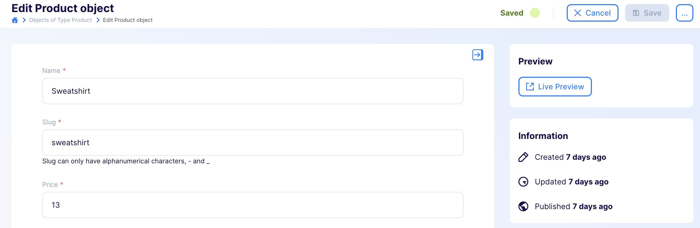
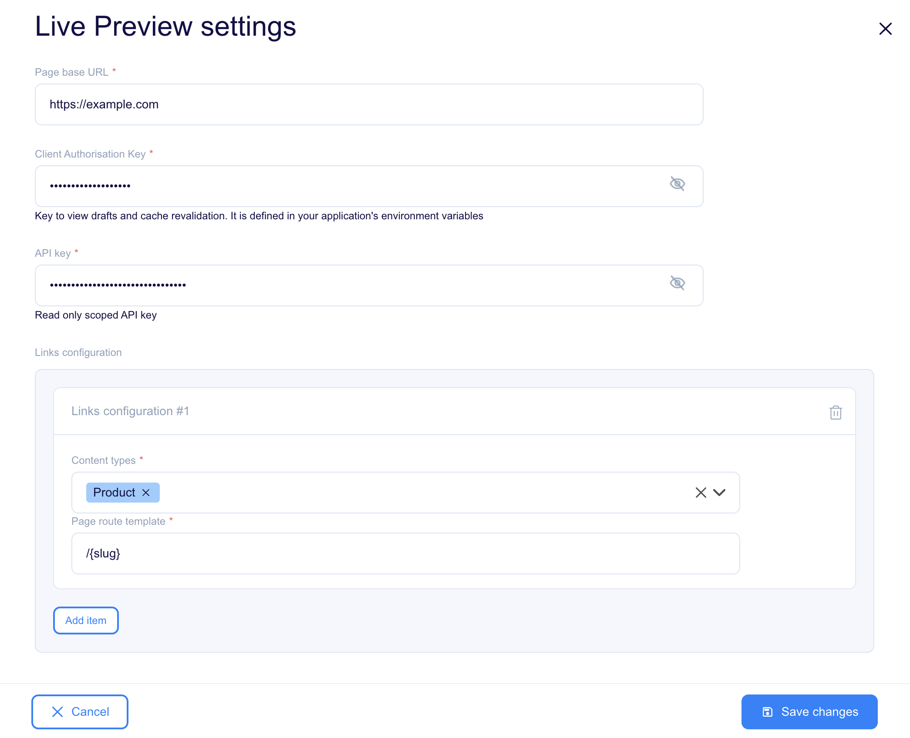

[[_TOC_]]

# Live Preview plugin

## Overview

The Live Preview Plugin is used for real-time transmission of data from content object forms, allowing the end application to display content changes live.
The plugin generates links that let you open drafts of your pages directly from the editor with a live streaming preview.
It works best with Next.js-based sites that use draft mode.

## Usage

While editing your objects, you will now have access to new action on the right hand-side. Live preview - opens a preview of the latest content on your form

Example: 

Imagine you've already have draft for a blog post, but now you want to make some updates. Instead of saving object form right away, you can use the Live Preview button. This lets you see your changes on the website before they will be saved.



## Configuration



### Page base URL

To start, you may want to use http://localhost:3000 to easily navigate between Flotiq and your local development environment. This will be accessible to all developers working on the site locally. Once you have your page deployed and publicly visible, you should change this URL.

### Client Authorisation Key

This key grants access to view drafts on your website. Make sure to define it in your application's environment variables. Without this key, the plugin won't be able to preview unpublished content.

### API Key

Flotiq API key used to authorize websocket connection.

### Content types

Specify the types of content for which you want the plugin to generate links.

### Page route template

Define the URL template for your content pages. For example, you might use /post/{slug}, where {slug} corresponds to a specific field in your content type, such as the post's title or ID. You can also use nested fields, like {internal.createdAt}, or list fields, such as {addresses[0].city}. This flexibility allows you to customize how your content URLs are structured.

### Next.js integration

You can integrate live preview functionality into any project by responding to events sent by the Live Preview plugin during content editing.
We've prepared a Next.js integration that allows you to add live preview support to your project in just a few steps.

Documentation and setup instructions for integrating it into your Next.js project can be found in the [@floiq/nextjs-live-preview](https://www.npmjs.com/package/@flotiq/nextjs-live-preview) package.


## Development

### Quick start

1. `yarn` - to install dependencies
2. `yarn start` - to start development mode - rebuild on file modifications
3. update your `plugin-manifest.json` file to contain the production URL and other plugin information
4. `yarn build` - to build plugins

### Dev environment

Dev environment is configured to use:

* `prettier` - best used with automatic format on save in IDE
* `eslint` - it is built into both `start` and `build` commands

### Output

The plugins are built into a single `dist/index.js` file. The manifest is copied to `dist/plugin-manifest.json` file.

### Deployment

<!-- TO DO -->

### Loading the plugin

**Warning:** While developing, you can use  `https://localhost:3053/plugin-manifest.json` address to load the plugin manifest. Make sure your browser trusts the local certificate on the latter, to be able to use it e.g. with `https://editor.flotiq.com`

#### URL

**Hint**: You can use localhost url from development mode `https://localhost:3053/index.js`

1. Open Flotiq editor
2. Open Chrome Dev console
3. Execute the following script
   ```javascript
   FlotiqPlugins.loadPlugin('plugin-id', '<URL TO COMPILED JS>')
   ```
4. Navigate to the view that is modified by the plugin

#### Directly

1. Open Flotiq editor
2. Open Chrome Dev console
3. Paste the content of `dist/index.js` 
4. Navigate to the view that is modified by the plugin

#### Deployment

**Hint**: You can use localhost url from development mode `https://localhost:3053/plugin-manifest.json`

1. Open Flotiq editor
2. Add a new plugin and paste the URL to the hosted `plugin-manifest.json` file
3. Navigate to the view that is modified by the plugin
